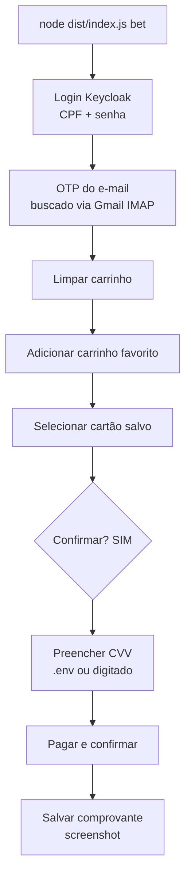

# 🎰 aposta

> Repita sua aposta salva nas Loterias CAIXA com um comando — login, código por e-mail e pagamento, automatizados.


> ### ⚠️ Aviso importante
>
> - Este projeto **não é afiliado, associado nem endossado pela CAIXA** ou pelas Loterias CAIXA.
> - Ferramenta de **uso pessoal e educacional**, para a conta do próprio usuário.
> - Automatizar o site das Loterias CAIXA **pode violar os Termos de Uso** e resultar em **bloqueio/suspensão da conta**.
> - Fornecido **"COMO ESTÁ", sem qualquer garantia** (ver [LICENSE](LICENSE)).
> - **Você é o único responsável** pelo uso, pelas apostas realizadas e por eventuais perdas financeiras.

## O que é

O site das Loterias CAIXA exige vários passos manuais para repetir uma aposta de rotina: login, código de segurança por e-mail, montar o carrinho, escolher o cartão, digitar o CVV. O `aposta` automatiza esse fluxo do início ao fim usando um carrinho favorito já salvo na sua conta — a interação humana fica restrita à confirmação final (digitar "SIM") e, opcionalmente, ao CVV do cartão, caso você prefira não deixá-lo salvo no `.env`.

## Como funciona

1. Faz login no site das Loterias CAIXA com CPF e senha.
2. Aguarda o código de verificação (OTP) enviado por e-mail e o busca automaticamente via IMAP no Gmail.
3. Limpa o carrinho atual e adiciona o carrinho favorito configurado.
4. Seleciona o cartão salvo e monta a confirmação do pedido.
5. Pede a confirmação explícita do usuário ("SIM") e o CVV (se não estiver no `.env`).
6. Efetua o pagamento e salva o comprovante (screenshot) da compra.



## Pré-requisitos

- Node.js 20 ou superior.
- Conta nas Loterias CAIXA com:
  - um jogo salvo em **Carrinhos Favoritos**;
  - um **cartão cadastrado** para pagamento.
- Gmail com **verificação em 2 etapas** ativa e um **App Password** (16 caracteres), usado para buscar o código OTP automaticamente via IMAP.

## Instalação

```bash
git clone https://github.com/lucasbemo/aposta-caixa.git
cd aposta-caixa
make install
make build
```

Prefere rodar sem `make`? Os comandos equivalentes estão em [docs/CLI.md](docs/CLI.md).

## Configuração

Crie os arquivos de configuração a partir dos exemplos (o `.env` já sai com permissão `600`; nada é sobrescrito se os arquivos já existirem):

```bash
make config
```

Preencha o `.env` (valores abaixo são apenas placeholders):

```
CAIXA_CPF=<seu cpf, somente números>
CAIXA_PASSWORD=<sua senha>
CAIXA_CARRINHO_FAVORITO=Nome exato do carrinho favorito
GMAIL_ADDRESS=voce@gmail.com
GMAIL_APP_PASSWORD=app password de 16 caracteres
CAIXA_CARD_CVV=            # OPCIONAL — ver aviso de segurança abaixo
```

Para gerar o Gmail App Password, acesse [myaccount.google.com/apppasswords](https://myaccount.google.com/apppasswords) — a conta precisa ter a verificação em 2 etapas (2FA) ativada.

No `config.json`, ajuste:

- `defaultCardLast4`: últimos 4 dígitos do cartão a ser selecionado no pagamento.
- `maxAmountPerRun`: valor máximo (R$) aceito por execução, como trava de segurança.
- `otpPollTimeoutSec`: tempo máximo de espera (segundos) pelo código OTP no e-mail.

> **Aviso de segurança:** preencher `CAIXA_CARD_CVV` guarda o CVV em texto claro no disco. Deixe a variável vazia para digitar o CVV manualmente a cada aposta — essa é a opção recomendada.

## Uso

Todos os alvos são executados com `make`, a partir da raiz do repositório:

| Comando | O que faz |
|---|---|
| `make dry-run` | Roda o fluxo inteiro **parando antes do pagamento** (valida seletores sem apostar). |
| `make bet` | Aposta **real**: pede confirmação "SIM", o CVV (se não estiver no `.env`), paga e salva o comprovante. |
| `make comprovante` | Re-salva o comprovante (screenshot) da compra mais recente. |
| `make history` | Lista as apostas registradas localmente. |
| `make setup` | Mostra as instruções de configuração inicial. |

`make` sem argumentos lista todos os alvos (incluindo `install`, `config`, `build`, `all` e `test`). Os comandos `node` equivalentes estão em [docs/CLI.md](docs/CLI.md).

Exemplo de saída (`make dry-run`):

```text
[step] login-request-code — ok
[step] otp — ok
[step] login-complete — ok
[step] clear-cart — ok
[step] checkout-ready — ok

Meu Jogo # · R$ 26.00 · cartão •••• 1234
DRY-RUN: cartão selecionado, parando antes do pagamento. Nenhuma aposta feita.
```

## Segurança & privacidade

- Roda 100% local — sem telemetria e sem envio de dados para qualquer serviço em nuvem.
- Segredos ficam no `.env`, com permissão restrita via `chmod 600` (senhas em texto claro é um trade-off assumido; não há integração com keychain do sistema).
- O CVV é **memory-only** por padrão; o auto-preenchimento via `.env` é **opcional e desencorajado**.
- O App Password do Gmail é **revogável** a qualquer momento em [myaccount.google.com/apppasswords](https://myaccount.google.com/apppasswords).
- A ferramenta **nunca registra** senha, CVV ou OTP nos logs (esses valores são redigidos).
- O número do cartão nunca é manuseado pela ferramenta — permanece apenas na conta CAIXA.

## Limitações conhecidas

- O site das Loterias CAIXA **muda sem aviso** e os seletores podem quebrar — use `--dry-run` para validar antes de apostar de fato.
- O site apresenta **muitos popups**, que precisam ser tratados durante a automação.
- **Logins automatizados repetidos podem acionar o anti-abuso da CAIXA**: o envio do OTP pode parar de funcionar temporariamente — espace as execuções.
- A CAIXA exige OTP em **todo** login, então não há como pular essa etapa.

## Desenvolvimento

Estrutura de pastas relevante (dentro de `aposta/`):

```
src/
  secrets.ts    # leitura e validação do .env
  config.ts     # leitura do config.json
  logger.ts     # logging com redação de segredos
  otp.ts        # busca do código OTP via IMAP (Gmail)
  payment.ts    # confirmação, guardrail de valor, prompt de CVV
  receipt.ts    # histórico local de apostas (JSON)
  browser.ts    # inicialização do Playwright/Chromium
  selectors.ts  # seletores do site das Loterias CAIXA
  flow.ts       # orquestração do fluxo (login → OTP → carrinho → pagamento → comprovante)
  index.ts      # CLI (commander): bet, comprovante, history, setup
tests/
```

Comandos:

```bash
make test     # Vitest — 18 testes das partes puras (secrets, config, logger, otp, payment, receipt)
make build    # compila TypeScript (tsc)
```

Os módulos de fluxo e navegador (`flow.ts`, `browser.ts`) dependem do site real das Loterias CAIXA e são validados **ao vivo** (via `bet --dry-run`), sem testes unitários automatizados.

## Licença

Distribuído sob a licença MIT. Ver [LICENSE](LICENSE).

Contribuições são bem-vindas via issues e pull requests — este é um projeto pessoal, mantido no tempo livre.
