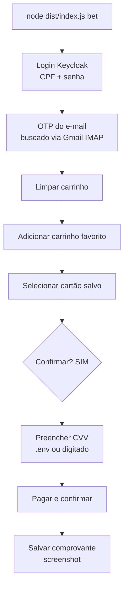

# Professional README + LICENSE + package.json Implementation Plan

> **For agentic workers:** REQUIRED SUB-SKILL: Use superpowers:subagent-driven-development (recommended) or superpowers:executing-plans to implement this plan task-by-task. Steps use checkbox (`- [ ]`) syntax for tracking.

**Goal:** Make the `caixa-loteria` repo look like a professional open-source GitHub project by adding a complete PT-BR `README.md`, an MIT `LICENSE`, and filling in `package.json` metadata.

**Architecture:** Pure documentation/metadata change. No source code is modified. Two independent tasks: (1) LICENSE + package.json metadata, (2) the README.

**Tech Stack:** Markdown, JSON, Mermaid (GitHub-native rendering).

## Global Constraints

Copied from the design spec (`docs/superpowers/specs/2026-07-17-readme-professional-design.md`):

- **Idioma: Português (BR).** Todo o README em PT-BR.
- **Autor / licença:** `Lucas Zamboni`, `Copyright (c) 2026 Lucas Zamboni`. Licença **MIT**.
- **Nome do repo (placeholder):** `aposta-caixa`; usuário do GitHub desconhecido → usar `<seu-usuario>` como placeholder explícito em URLs.
- **Disclaimers obrigatórios e proeminentes** (topo do README): não afiliado à CAIXA; uso pessoal/educacional; automatizar o site pode violar os Termos de Uso e bloquear a conta; sem garantia; usuário é o único responsável.
- **Nada de segredos reais** em exemplos — só placeholders. Nenhum CPF, senha, cartão, CVV real.
- **Só documentar o que existe.** Comandos reais do CLI: `bet`, `bet --dry-run`, `comprovante`, `history`, `setup`. Não inventar recursos.
- **Sem linguagem de incentivo ao jogo** ("dinheiro fácil" etc.).
- README fica na **raiz** do repo (`/README.md`); LICENSE na **raiz** (`/LICENSE`); metadados em `aposta/package.json`.

---

## File Structure

```
caixa-loteria/
├── README.md          # NOVO (raiz, PT-BR)
├── LICENSE            # NOVO (raiz, MIT)
└── aposta/
    └── package.json   # MODIFICADO (metadados)
```

---

### Task 1: LICENSE + package.json metadata

**Files:**
- Create: `/Users/lucas/workspace/caixa-loteria/LICENSE`
- Modify: `/Users/lucas/workspace/caixa-loteria/aposta/package.json`

**Interfaces:**
- Consumes: nada.
- Produces: um `LICENSE` MIT válido na raiz e um `package.json` com `description`, `license`, `author`, `repository`, `keywords`.

- [ ] **Step 1: Criar `/LICENSE` com o texto MIT exato**

```
MIT License

Copyright (c) 2026 Lucas Zamboni

Permission is hereby granted, free of charge, to any person obtaining a copy
of this software and associated documentation files (the "Software"), to deal
in the Software without restriction, including without limitation the rights
to use, copy, modify, merge, publish, distribute, sublicense, and/or sell
copies of the Software, and to permit persons to whom the Software is
furnished to do so, subject to the following conditions:

The above copyright notice and this permission notice shall be included in all
copies or substantial portions of the Software.

THE SOFTWARE IS PROVIDED "AS IS", WITHOUT WARRANTY OF ANY KIND, EXPRESS OR
IMPLIED, INCLUDING BUT NOT LIMITED TO THE WARRANTIES OF MERCHANTABILITY,
FITNESS FOR A PARTICULAR PURPOSE AND NONINFRINGEMENT. IN NO EVENT SHALL THE
AUTHORS OR COPYRIGHT HOLDERS BE LIABLE FOR ANY CLAIM, DAMAGES OR OTHER
LIABILITY, WHETHER IN AN ACTION OF CONTRACT, TORT OR OTHERWISE, ARISING FROM,
OUT OF OR IN CONNECTION WITH THE SOFTWARE OR THE USE OR OTHER DEALINGS IN THE
SOFTWARE.
```

- [ ] **Step 2: Preencher os metadados em `aposta/package.json`**

Adicionar estes campos ao objeto de topo (manter `name`, `version`, `type`, `bin`, `scripts`, `dependencies`, `devDependencies` como estão). Inserir logo após `"version": "0.1.0",`:

```json
  "description": "CLI pessoal para repetir apostas salvas nas Loterias CAIXA (login + OTP automático via IMAP, pagamento e comprovante).",
  "license": "MIT",
  "author": "Lucas Zamboni",
  "repository": {
    "type": "git",
    "url": "https://github.com/<seu-usuario>/aposta-caixa.git"
  },
  "keywords": ["caixa", "loterias", "cli", "playwright", "automation", "mega-sena", "lotofacil"],
```

- [ ] **Step 3: Verificar que o `package.json` continua válido e o npm o lê**

Run: `cd /Users/lucas/workspace/caixa-loteria/aposta && node -e "const p=require('./package.json'); console.log(p.name, p.version, p.license, p.author); if(!p.license||!p.description||!p.repository||!p.keywords) throw new Error('metadados faltando')"`
Expected: imprime `aposta 0.1.0 MIT Lucas Zamboni` sem erro (JSON válido, campos presentes).

- [ ] **Step 4: Verificar o LICENSE**

Run: `head -3 /Users/lucas/workspace/caixa-loteria/LICENSE`
Expected: primeira linha `MIT License`, terceira linha `Copyright (c) 2026 Lucas Zamboni`.

- [ ] **Step 5: Commit**

```bash
cd /Users/lucas/workspace/caixa-loteria && git add LICENSE aposta/package.json && git commit -m "docs: add MIT LICENSE and package.json metadata"
```

---

### Task 2: README.md (PT-BR, raiz)

**Files:**
- Create: `/Users/lucas/workspace/caixa-loteria/README.md`

**Interfaces:**
- Consumes: a licença (Task 1) para o link/menção; os comandos reais do CLI (`src/index.ts`).
- Produces: `/README.md` com as 13 seções da spec.

- [ ] **Step 1: Escrever o cabeçalho — título, tagline e badges**

Título `# 🎰 aposta`, uma tagline de uma linha, e os badges estáticos (shields.io, não dependem de CI):

```markdown
# 🎰 aposta

> Repita sua aposta salva nas Loterias CAIXA com um comando — login, código por e-mail e pagamento, automatizados.


```

- [ ] **Step 2: Escrever o bloco "⚠️ Aviso importante"**

Logo após os badges, um bloco de citação (`>`) em destaque contendo, como itens:
- Este projeto **não é afiliado, associado nem endossado pela CAIXA** ou pelas Loterias CAIXA.
- Ferramenta de **uso pessoal e educacional**, para a conta do próprio usuário.
- Automatizar o site das Loterias CAIXA **pode violar os Termos de Uso** e resultar em **bloqueio/suspensão da conta**.
- Fornecido **"COMO ESTÁ", sem qualquer garantia** (ver [LICENSE](LICENSE)).
- **Você é o único responsável** pelo uso, pelas apostas realizadas e por eventuais perdas financeiras.

- [ ] **Step 3: Escrever "## O que é" e "## Como funciona" (com diagrama Mermaid)**

"O que é": 2–3 frases sobre o problema (site lento, muitos passos) e a solução (repetir a aposta salva com o mínimo de interação — só o "SIM" e o CVV, se não estiver no `.env`).

"Como funciona": lista dos passos, seguida do diagrama Mermaid abaixo (renderiza nativamente no GitHub):

````markdown

````

- [ ] **Step 4: Escrever "## Pré-requisitos" e "## Instalação"**

Pré-requisitos (lista): Node.js 20+; conta nas Loterias CAIXA com (a) um jogo salvo em **Carrinhos Favoritos** e (b) um **cartão cadastrado**; Gmail com **verificação em 2 etapas** ativa e um **App Password** (16 caracteres) para o OTP automático via IMAP.

Instalação (bloco de código):
```bash
git clone https://github.com/<seu-usuario>/aposta-caixa.git
cd aposta-caixa/aposta
npm install
npx playwright install chromium
npm run build
```

- [ ] **Step 5: Escrever "## Configuração"**

Passos: copiar `.env.example` para `.env`, preencher, e `chmod 600 .env`. Mostrar as variáveis (com placeholders, SEM valores reais):
```bash
cp .env.example .env
chmod 600 .env
```
```
CAIXA_CPF=00000000000
CAIXA_PASSWORD=sua-senha
CAIXA_CARRINHO_FAVORITO=Nome exato do carrinho favorito
GMAIL_ADDRESS=voce@gmail.com
GMAIL_APP_PASSWORD=app password de 16 caracteres
CAIXA_CARD_CVV=            # OPCIONAL — ver aviso de segurança abaixo
```
Explicar: como gerar o Gmail App Password (myaccount.google.com/apppasswords, precisa de 2FA); ajustar `config.json` (`defaultCardLast4`, `maxAmountPerRun`, `otpPollTimeoutSec`). Incluir um **aviso de segurança** curto: preencher `CAIXA_CARD_CVV` guarda o CVV em texto claro no disco — deixe vazio para digitá-lo a cada aposta.

- [ ] **Step 6: Escrever "## Uso" com exemplos**

Tabela dos comandos + um exemplo de saída do `bet --dry-run`. Todos rodados de dentro de `aposta/`:

| Comando | O que faz |
|---|---|
| `node dist/index.js bet --dry-run` | Roda o fluxo inteiro **parando antes do pagamento** (valida seletores sem apostar). |
| `node dist/index.js bet` | Aposta **real**: pede confirmação "SIM", o CVV (se não estiver no `.env`), paga e salva o comprovante. |
| `node dist/index.js comprovante` | Re-salva o comprovante (screenshot) da compra mais recente. |
| `node dist/index.js history` | Lista as apostas registradas localmente. |
| `node dist/index.js setup` | Mostra as instruções de configuração inicial. |

Exemplo de saída (dry-run):
```text
[step] login-request-code — ok
[step] otp — ok
[step] login-complete — ok
[step] clear-cart — ok
[step] checkout-ready — ok

Meu Jogo # · R$ 26.00 · cartão •••• 1234
DRY-RUN: cartão selecionado, parando antes do pagamento. Nenhuma aposta feita.
```

- [ ] **Step 7: Escrever "## Segurança & privacidade" e "## Limitações conhecidas"**

Segurança (lista): roda 100% local, sem telemetria/nuvem; segredos no `.env` com `chmod 600` (senhas em texto claro — trade-off assumido, sem keychain); CVV é **memory-only** por padrão e o auto-fill via `.env` é **opcional e desencorajado**; o App Password do Gmail é **revogável** a qualquer momento; a ferramenta **nunca registra** senha, CVV ou OTP (redação nos logs); o número do cartão nunca é manuseado (fica na conta CAIXA).

Limitações (lista): o site das Loterias CAIXA **muda sem aviso** e os seletores podem quebrar — use `--dry-run` para validar antes de apostar; o site tem **muitos popups**; **logins automatizados repetidos podem acionar o anti-abuso da CAIXA** (o OTP pode parar de ser enviado por um tempo — espace as execuções); a CAIXA pede OTP em **todo** login.

- [ ] **Step 8: Escrever "## Desenvolvimento" e "## Licença"**

Desenvolvimento: estrutura de pastas (`aposta/src/` — módulos `secrets`, `config`, `logger`, `otp`, `payment`, `receipt`, `browser`, `selectors`, `flow`, `index`; `aposta/tests/`); comandos `npm test` (Vitest — 18 testes das partes puras) e `npm run build` (tsc). Nota: os módulos de fluxo/navegador são validados **ao vivo** (dependem do site real, sem testes unitários).

Licença: uma linha — "Distribuído sob a licença MIT. Ver [LICENSE](LICENSE)." Opcional: uma linha de "Contribuições" (issues/PRs bem-vindos; projeto pessoal).

- [ ] **Step 9: Verificar o README — sem segredos, comandos reais, Mermaid**

Run: `cd /Users/lucas/workspace/caixa-loteria && grep -nE "email@exemplo|[0-9]{11}|CAIXA_PASSWORD=[^ ]*[a-zA-Z0-9]{4}" README.md || echo "OK: sem segredos aparentes"`
Expected: `OK: sem segredos aparentes` (nenhum CPF real de 11 dígitos, e-mail real, ou senha preenchida).

Run: `cd /Users/lucas/workspace/caixa-loteria && grep -c "mermaid" README.md && grep -oE "dist/index.js (bet|comprovante|history|setup)" README.md | sort -u`
Expected: pelo menos 1 bloco `mermaid`; e a lista de comandos bate com os reais (`bet`, `comprovante`, `history`, `setup`).

Verificação manual: abrir o README e confirmar que o bloco de aviso está no topo (após os badges) e que todas as 13 seções da spec estão presentes.

- [ ] **Step 10: Commit**

```bash
cd /Users/lucas/workspace/caixa-loteria && git add README.md && git commit -m "docs: add professional PT-BR README"
```

---

## Self-Review

**Cobertura da spec (cada seção → tarefa):**
- README §1 título/tagline → Task 2 Step 1 ✓
- §2 badges → Task 2 Step 1 ✓
- §3 aviso/disclaimer → Task 2 Step 2 ✓
- §4 o que é → Task 2 Step 3 ✓
- §5 como funciona + Mermaid → Task 2 Step 3 ✓
- §6 pré-requisitos → Task 2 Step 4 ✓
- §7 instalação → Task 2 Step 4 ✓
- §8 configuração → Task 2 Step 5 ✓
- §9 uso → Task 2 Step 6 ✓
- §10 segurança → Task 2 Step 7 ✓
- §11 limitações → Task 2 Step 7 ✓
- §12 desenvolvimento → Task 2 Step 8 ✓
- §13 contribuindo + licença → Task 2 Step 8 ✓
- LICENSE (spec §5) → Task 1 ✓
- package.json metadata (spec §6) → Task 1 ✓

**Placeholder scan:** os `<seu-usuario>` são placeholders **intencionais** (usuário do GitHub desconhecido; o autor ajusta) e estão declarados nas Global Constraints. Nenhum "TODO/TBD" de conteúdo.

**Ambiguidade:** nome do autor e nome do repo fixados nas Global Constraints (Lucas Zamboni / aposta-caixa) — sem ambiguidade para o implementador.

**Nota de verificação:** por ser doc, o "teste" de cada tarefa é a verificação via `grep`/`node -e` (Task 1 Step 3–4; Task 2 Step 9) — sem testes unitários, e o `npm test` de código (18) deve permanecer verde (nenhum código-fonte é tocado).
